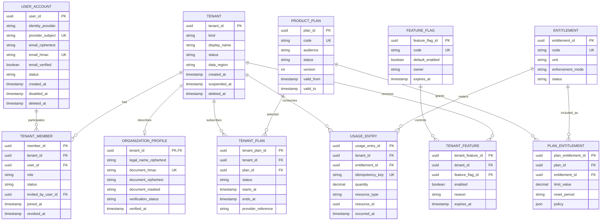
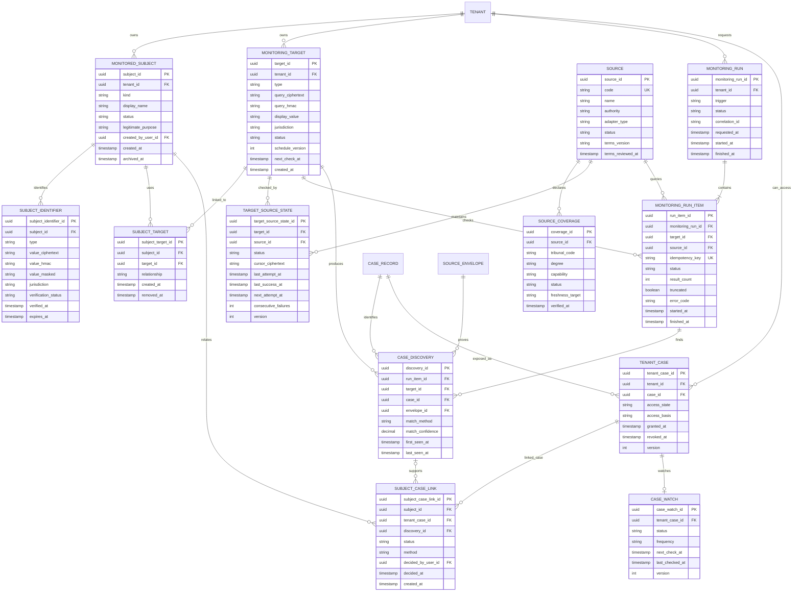
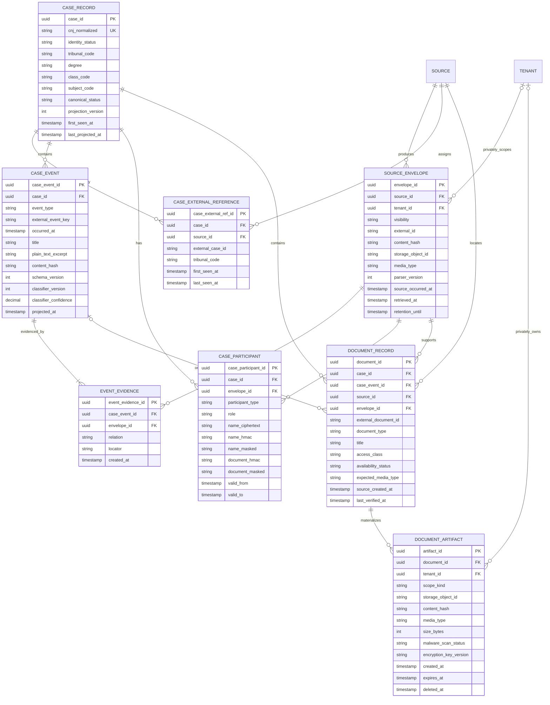
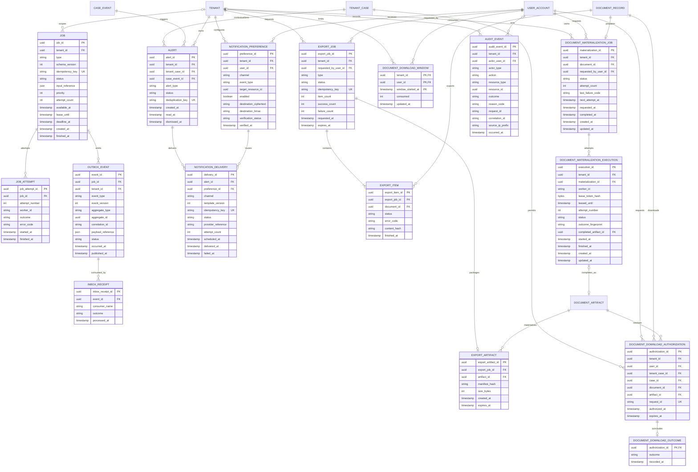
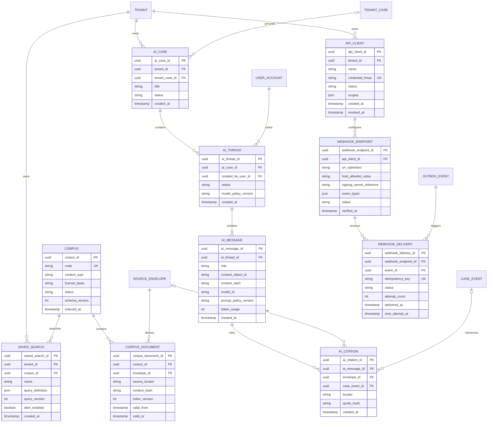

# MER 0001 — modelo entidade-relacionamento do Meu Processo

**Status:** aceito como modelo lógico inicial
**Data:** 30 de agosto de 2026
**Escopo:** fundação, acompanhamento, evidências, documentos, operação e extensões planejadas
**Relacionado:** [Spec 0009](../specs/0009-scalable-product-foundation.md), [ADR 0015](../adr/0015-logical-model-and-firestore-projections.md), [ADR 0016](../adr/0016-managed-supabase-postgres.md)

## 1. Objetivo e leitura

Este documento define o modelo lógico e as invariantes do sistema. Ele é
independente do banco. O Supabase PostgreSQL implementará tabelas, constraints e
projeções derivadas; um índice de busca futuro continuará usando a mesma
semântica.

Os diagramas são divididos para permanecerem legíveis:

1. identidade, tenant e oferta;
2. monitoramento e descoberta;
3. processos, evidências e documentos;
4. jobs, notificações, exportações e auditoria;
5. pesquisa, IA e API futuras.

Convenções:

- `PK`: chave primária interna e opaca;
- `FK`: referência a outra entidade;
- `UK`: constraint única lógica;
- `tenant_id`: obrigatório em todo dado privado;
- timestamps são UTC; a UI converte para horário de Brasília;
- exclusão lógica usa `deleted_at` somente quando necessária;
- fatos/evidências imutáveis não possuem exclusão lógica comum, mas política de
  retenção, restrição e tombstone auditado;
- atributos `*_hash` sensíveis usam HMAC com chave versionada, não hash simples.

## 2. Identidade, tenant, papéis e oferta



### Regras deste domínio

- `TENANT.kind` é `PERSONAL` ou `ORGANIZATION`.
- Tenant pessoal possui exatamente um membro ativo `OWNER`; tenant organizacional
  possui ao menos um `OWNER` ativo.
- `ORGANIZATION_PROFILE` só existe para tenant organizacional.
- `TENANT_MEMBER` é único por `(tenant_id, user_id)` enquanto ativo.
- Papel autoriza ações; entitlement limita produto/volume; feature flag controla
  rollout. Uma decisão nunca substitui as outras.
- E-mail e documento não são armazenados em texto puro. Busca exata usa HMAC
  versionado; exibição usa versão mascarada ou decriptografia autorizada.
- `USAGE_ENTRY` é append-only e idempotente; faturamento futuro deriva dele, não
  de logs operacionais.

## 3. Perfis monitorados, alvos e descoberta



### Semântica de alvo, vínculo e acesso

- `MONITORED_SUBJECT` é a pessoa, empresa ou cliente dentro do tenant.
- `SUBJECT_IDENTIFIER` representa nome, variação, CPF, CNPJ ou OAB que descreve
  o perfil. Não é necessariamente consultável em toda fonte.
- `MONITORING_TARGET` é uma consulta efetivamente executável, tenant-scoped.
- `SUBJECT_TARGET` permite reutilizar um alvo em mais de um perfil do mesmo
  tenant sem duplicar coleta.
- `CASE_DISCOVERY` é evidência de que alvo/fonte encontrou um processo; não
  confirma identidade.
- `SUBJECT_CASE_LINK.status` usa `CANDIDATE`, `CONFIRMED_BY_SOURCE`,
  `CONFIRMED_BY_USER`, `REJECTED` ou `REVOKED`.
- `TENANT_CASE` é o limite de autorização para um processo. Um cliente nunca
  acessa `CASE_RECORD` diretamente.
- `CASE_WATCH` representa acompanhamento ativo do processo conhecido e é
  diferente de monitorar um nome, CPF ou OAB.

### Constraints

- `MONITORING_TARGET` único por
  `(tenant_id, type, query_hmac, jurisdiction, status_active)`.
- `TARGET_SOURCE_STATE` único por `(target_id, source_id)`.
- `MONITORING_RUN_ITEM` único por `(monitoring_run_id, target_id, source_id)`.
- `CASE_DISCOVERY` deduplica por `(target_id, case_id, envelope_id)`.
- `TENANT_CASE` único por `(tenant_id, case_id)` enquanto não revogado.
- `SUBJECT_CASE_LINK` único ativo por `(subject_id, tenant_case_id)`.
- `CASE_WATCH` no máximo um ativo por `tenant_case_id`.
- Nome semelhante nunca muda vínculo de `CANDIDATE` para confirmado.
- Um `REJECTED` não é reaberto automaticamente; nova evidência cria decisão
  revisável e auditada.

## 4. Processo canônico, eventos, evidências e documentos



### Regras de evidência

- `SOURCE_ENVELOPE` é append-only e único por
  `(source_id, visibility_scope, external_id, content_hash)`.
- `tenant_id` é obrigatório quando `visibility=TENANT_PRIVATE` e nulo somente
  quando a classificação `PUBLIC_OFFICIAL` tiver sido juridicamente aprovada.
- `storage_object_id` é interno e opaco; URL externa ou assinada não é persistida
  como identificador público.
- `CASE_RECORD` com CNJ válido é único por `cnj_normalized`. Sem CNJ, a identidade
  permanece provisória e usa referência composta de fonte/tribunal.
- `CASE_EXTERNAL_REFERENCE` é única por `(source_id, external_case_id)`.
- `CASE_EVENT` é projeção reconstruível. A unicidade usa external event key
  quando confiável; caso contrário, `(case_id, occurred_at, content_hash,
  source_id)` por meio da evidência.
- `EVENT_EVIDENCE` permite várias fontes sustentarem o mesmo evento sem apagar
  divergências.
- `plain_text_excerpt` contém somente texto sanitizado, limitado e necessário ao
  painel. O integral fica no envelope/object storage quando permitido.
- `CASE_PARTICIPANT` nunca é usado sozinho para unir processos ou confirmar uma
  pessoa. Nome e documento recebem proteção e acesso mínimo.
- `DOCUMENT_RECORD` é metadado; `DOCUMENT_ARTIFACT` é o arquivo materializado.
- Artefato `TENANT_PRIVATE` exige `tenant_id`; cache global só é permitido para
  documento público com finalidade e retenção aprovadas.

## 5. Jobs, notificações, exportações e auditoria



### Regras operacionais

- `JOB.tenant_id` pode ser nulo somente para ingestão pública global aprovada;
  job privado sempre possui tenant.
- `JOB.idempotency_key` é único dentro de `(tenant_scope, type)`.
- apenas uma tentativa possui lease válido por job; lease expirado permite
  retomada.
- `DOCUMENT_MATERIALIZATION_JOB` é a especialização física inicial de `JOB`
  para um documento tenant-private. Existe no máximo um por
  `(tenant_id, document_id)`; sua FK composta impede referência cross-tenant.
- `DOCUMENT_MATERIALIZATION_EXECUTION` é append-only por tentativa. Só uma
  execução pode estar `RUNNING` por job; o lease é curto e somente o hash do
  token é persistido. Lease expirado cria nova tentativa, nunca reutiliza a
  execução anterior.
- A solicitação web não escreve tabelas diretamente: uma função tenant-scoped
  valida processo, documento, acesso público, PDF e fonte revisada. O worker
  dedicado usa apenas funções de `claim`, `complete` e `fail`.
- `completed_artifact_id` só é preenchido após publicação privada, hash,
  tamanho e scan limpo. O locator permanece interno e não integra a resposta da
  solicitação.
- `OUTBOX_EVENT` é gravado na mesma transação do aggregate que originou o fato.
- `INBOX_RECEIPT` é único por `(event_id, consumer_name)`.
- `ALERT.deduplication_key` inclui tenant, watch/event e tipo; replay não cria
  novo alerta.
- entrega é única por `(alert, channel, destination, template_version)`.
- canal externo só usa destino verificado.
- exportação pertence a um tenant, guarda falhas por item e expira; o ZIP contém
  manifesto e hashes.
- quota de download é consumida atomicamente por tenant, usuário e minuto antes
  de qualquer leitura do object storage.
- autorização de download é append-only, curta e vincula exatamente membership,
  tenant case, processo, documento e artefato; possui no máximo um outcome.
- `AUDIT_EVENT` é append-only, não armazena texto processual, documento, token,
  e-mail, CPF/CNPJ ou URL assinada.

## 6. Extensões futuras: pesquisa, IA e API

Estas entidades reservam limites de domínio, mas não fazem parte do MVP
persistente.



Regras:

- `CORPUS.license_basis` e retenção são obrigatórios antes da indexação.
- pesquisa sempre identifica corpus, versão e período.
- `AI_CASE` pertence a exatamente um tenant e opcionalmente um único
  `TENANT_CASE`; contexto não cruza casos.
- conteúdo de mensagem fica em objeto tenant-scoped; banco guarda referência e
  hash.
- resposta de IA material exige `AI_CITATION`; ausência de evidência produz
  recusa/limitação.
- credencial de API e segredo de webhook têm Infisical como fonte de verdade e
  Secret Manager como entrega ao runtime; banco guarda somente HMAC/referência.
- webhook valida host, assina payload, bloqueia replay e é idempotente.

## 7. Dicionário de entidades

| Grupo | Entidade | Dono/escopo | Mutabilidade | Finalidade |
|---|---|---|---|---|
| Identidade | `USER_ACCOUNT` | plataforma | mutável/auditada | identidade interna ligada ao provedor |
| Tenant | `TENANT` | plataforma | mutável/auditada | limite pessoal ou organizacional |
| Tenant | `TENANT_MEMBER` | tenant | mutável/auditada | membership e papel |
| Tenant | `ORGANIZATION_PROFILE` | tenant | mutável/auditada | dados verificados da organização |
| Oferta | `PRODUCT_PLAN` | plataforma | versionada | catálogo de planos |
| Oferta | `ENTITLEMENT` | plataforma | versionada | capacidade ou unidade de consumo |
| Oferta | `TENANT_PLAN` | tenant | temporal | plano vigente/histórico |
| Oferta | `USAGE_ENTRY` | tenant | append-only | consumo idempotente |
| Rollout | `FEATURE_FLAG` | plataforma | temporal | ativação controlada |
| Rollout | `TENANT_FEATURE` | tenant | temporal | override por tenant |
| Monitoramento | `MONITORED_SUBJECT` | tenant | mutável | perfil/cliente acompanhado |
| Monitoramento | `SUBJECT_IDENTIFIER` | tenant | mutável/protegida | nome, documento ou OAB verificado |
| Monitoramento | `MONITORING_TARGET` | tenant | mutável/versionada | consulta executável |
| Monitoramento | `SUBJECT_TARGET` | tenant | temporal | reutilização do alvo por perfil |
| Fonte | `SOURCE` | plataforma | versionada | catálogo e termos da fonte |
| Fonte | `SOURCE_COVERAGE` | plataforma | temporal | cobertura por tribunal/capacidade |
| Monitoramento | `TARGET_SOURCE_STATE` | tenant | mutável/concorrente | cursor e saúde por alvo/fonte |
| Monitoramento | `MONITORING_RUN` | tenant | state machine | execução solicitada/agendada |
| Monitoramento | `MONITORING_RUN_ITEM` | tenant | state machine | unidade alvo/fonte da execução |
| Descoberta | `CASE_DISCOVERY` | tenant + evidência | append/upsert idempotente | prova de descoberta de processo |
| Autorização | `TENANT_CASE` | tenant | mutável/auditada | acesso do tenant ao caso |
| Vínculo | `SUBJECT_CASE_LINK` | tenant | state machine | candidato/confirmação/rejeição |
| Monitoramento | `CASE_WATCH` | tenant | mutável/versionada | acompanhamento de CNJ conhecido |
| Evidência | `SOURCE_ENVELOPE` | público ou tenant | append-only | original e proveniência |
| Processo | `CASE_RECORD` | plano de evidência | projeção versionada | identidade canônica do processo |
| Processo | `CASE_EXTERNAL_REFERENCE` | plano de evidência | temporal | IDs do processo em cada fonte |
| Processo | `CASE_EVENT` | plano de evidência | projeção versionada | evento/linha do tempo |
| Evidência | `EVENT_EVIDENCE` | plano de evidência | append-only | suporte fonte → evento |
| Processo | `CASE_PARTICIPANT` | evidência protegida | temporal | papel/parte conforme fonte |
| Documento | `DOCUMENT_RECORD` | plano de evidência | temporal | metadado e disponibilidade |
| Documento | `DOCUMENT_ARTIFACT` | público aprovado ou tenant | temporal/TTL | arquivo obtido/materializado |
| Async | `JOB` | público ou tenant | state machine | trabalho durável |
| Async | `JOB_ATTEMPT` | job | append-only | tentativa e erro seguro |
| Async | `OUTBOX_EVENT` | aggregate/tenant | append-only | fato a publicar |
| Async | `INBOX_RECEIPT` | consumidor | append-only | deduplicação do consumidor |
| Notificação | `NOTIFICATION_PREFERENCE` | tenant/usuário | mutável | canal e evento consentidos |
| Notificação | `ALERT` | tenant | state machine | novidade dentro do painel |
| Notificação | `NOTIFICATION_DELIVERY` | tenant | state machine | tentativa de canal externo |
| Exportação | `EXPORT_JOB` | tenant | state machine | lote solicitado |
| Exportação | `EXPORT_ITEM` | exportação | state machine | resultado por documento |
| Exportação | `EXPORT_ARTIFACT` | tenant | temporal/TTL | ZIP e manifesto |
| Auditoria | `AUDIT_EVENT` | tenant/plataforma | append-only | decisão de segurança/ação |
| Pesquisa | `CORPUS` | plataforma | versionada | corpus permitido |
| Pesquisa | `CORPUS_DOCUMENT` | corpus | temporal/versionada | item indexável |
| Pesquisa | `SAVED_SEARCH` | tenant | mutável/versionada | consulta reproduzível |
| IA | `AI_CASE` | tenant | mutável | contexto isolado |
| IA | `AI_THREAD` | tenant/caso | mutável | conversa |
| IA | `AI_MESSAGE` | tenant/caso | append-only | mensagem e versão do modelo |
| IA | `AI_CITATION` | mensagem/evidência | append-only | suporte verificável |
| API | `API_CLIENT` | tenant | mutável/auditada | cliente e scopes |
| API | `WEBHOOK_ENDPOINT` | API client | mutável/auditada | destino verificado |
| API | `WEBHOOK_DELIVERY` | endpoint | state machine | entrega e retry |

## 8. Classificação de dados

| Classe | Exemplos | Regras mínimas |
|---|---|---|
| Identidade/autenticação | provider subject, e-mail, membership | criptografia, mínimo privilégio, sem logs |
| Identificador sensível | CPF, CNPJ, OAB, telefone | ciphertext + HMAC versionado + máscara; finalidade e auditoria |
| Dado processual público | CNJ, evento, publicação oficial | acesso por grant, proveniência, retenção aprovada; não indexar indiscriminadamente |
| Dado processual restrito | autos credencializados/segredo | tenant-scoped, acesso comprovado, sem cache global |
| Dado do cliente | perfil, tags, responsáveis, preferências | tenant obrigatório e exclusão/exportação |
| Derivado/classificado | status, confiança, explicação, resumo | versão, evidência, rótulo e rebuild |
| Credencial/capacidade | token, signing secret, URL assinada | Infisical → Secret Manager/memória; nunca persistir plaintext/log |
| Operacional | job, error code, correlation | IDs técnicos, retenção curta, sem conteúdo |
| Auditoria | ator, ação, outcome | append-only, acesso restrito, retenção definida |

## 9. Constraints globais

1. Toda entidade privada possui `tenant_id` direto ou alcançável por uma única
   relação obrigatória dentro do mesmo aggregate.
2. FK cross-tenant é inválida, mesmo que os IDs existam.
3. `TENANT_CASE` é a única porta de exposição de `CASE_RECORD` ao tenant.
4. Fato público e grant privado têm ciclos de vida distintos.
5. CPF/CNPJ/e-mail/telefone não aparecem em chave, URL, log ou evento.
6. Documento e texto integral não entram no PostgreSQL; usa-se objeto com hash e
   metadata, mantendo no banco apenas conteúdo curto estritamente necessário.
7. Natural keys são normalizadas e validadas, mas não substituem PK opaca.
8. Nenhuma entidade é unida por similaridade de nome.
9. Escrita concorrente em aggregate mutável usa `version`/precondition.
10. Projeções carregam versão e são reconstruíveis.
11. Outbox e aggregate são gravados atomicamente.
12. Estado terminal não retrocede sem comando explícito e auditoria.
13. Excluir tenant revoga acesso, cancela jobs e agenda purge conforme retenção;
    não apaga automaticamente evidência pública com finalidade independente.
14. Relatórios e IA leem somente projeções autorizadas, não buckets globais.

## 10. Mapeamento físico inicial para Supabase PostgreSQL

O mapeamento abaixo é proposta inicial. A spec de persistência deverá validar
volume, preço, limites, pool, RLS e queries com Supabase/PostgreSQL local antes
de provisionar.

### 10.1 Tabelas e agregados principais

| Tabela/projeção | Aggregate | Entidades lógicas | Chave/partição |
|---|---|---|---|
| `user_accounts` | conta | `USER_ACCOUNT` | `user_id` |
| `tenants` | tenant | `TENANT`, resumo de plano | `tenant_id` |
| `tenant_members` | membership | `TENANT_MEMBER` | unique `tenant_id + user_id` |
| `organization_profiles` | organização | `ORGANIZATION_PROFILE` | `tenant_id` |
| `monitored_subjects` | perfil | `MONITORED_SUBJECT` + identificadores bounded | `tenant_id`, `subject_id` |
| `monitoring_targets` | alvo | `MONITORING_TARGET` + source states bounded | `tenant_id`, `target_id` |
| `subject_targets` | relação | `SUBJECT_TARGET` | `tenant_id`, `subject_id` |
| `monitoring_runs` | run | `MONITORING_RUN` | `tenant_id`, `requested_at` |
| `monitoring_run_items` | unidade de run | `MONITORING_RUN_ITEM` | `run_id`, `status` |
| `case_discoveries` | descoberta | `CASE_DISCOVERY` | `tenant_id`, `target_id` |
| `tenant_cases` | autorização/projeção de carteira | `TENANT_CASE`, resumo do caso/watch | `tenant_id`, `case_id` |
| `subject_case_links` | vínculo | `SUBJECT_CASE_LINK` | `tenant_id`, `subject_id` |
| `sources` | fonte | `SOURCE` | `source_id` |
| `source_coverage` | cobertura | `SOURCE_COVERAGE` | `source_id`, tribunal/capability |
| `source_envelopes` | metadata do original | `SOURCE_ENVELOPE` | visibility scope, source/hash |
| `case_records` | processo canônico | `CASE_RECORD` + external refs bounded | `case_id`, unique CNJ |
| `case_events` | evento | `CASE_EVENT` | `case_id`, occurred_at cursor |
| `event_evidence` | suporte | `EVENT_EVIDENCE` | `case_event_id` |
| `case_participants` | participante | `CASE_PARTICIPANT` | `case_id`, role |
| `document_records` | documento | `DOCUMENT_RECORD` | `case_id`, event_id |
| `document_artifacts` | materialização | `DOCUMENT_ARTIFACT` | tenant/scope, expiry |
| `document_materialization_jobs` | preparação de documento | `DOCUMENT_MATERIALIZATION_JOB` | tenant, documento, status |
| `document_materialization_executions` | lease/tentativa de preparação | `DOCUMENT_MATERIALIZATION_EXECUTION` | tenant, materialização, tentativa |
| `document_download_windows` | quota curta | `DOCUMENT_DOWNLOAD_WINDOW` | tenant, user, minuto |
| `document_download_authorizations` | autorização/auditoria | `DOCUMENT_DOWNLOAD_AUTHORIZATION` | tenant, user, documento |
| `document_download_outcomes` | resultado imutável | `DOCUMENT_DOWNLOAD_OUTCOME` | authorization_id |
| `jobs` | job | `JOB` | scope, status, available_at |
| `job_attempts` | tentativa | `JOB_ATTEMPT` | `job_id`, attempt_number |
| `outbox_events` | outbox | `OUTBOX_EVENT` | status, occurred_at |
| `inbox_receipts` | inbox | `INBOX_RECEIPT` | deterministic consumer+event ID |
| `alerts` | alerta | `ALERT` | `tenant_id`, status, created_at |
| `notification_preferences` | preferência | `NOTIFICATION_PREFERENCE` | `tenant_id`, user/channel |
| `notification_deliveries` | entrega | `NOTIFICATION_DELIVERY` | status, scheduled_at |
| `export_jobs` | exportação | `EXPORT_JOB` + item counters | `tenant_id`, requested_at |
| `export_items` | item | `EXPORT_ITEM` | `export_job_id`, status |
| `audit_events` | auditoria | `AUDIT_EVENT` | `tenant_id`, occurred_at |
| `usage_entries` | consumo | `USAGE_ENTRY` | `tenant_id`, occurred_at |

### 10.2 Denormalização permitida

- `tenant_cases` pode copiar CNJ, tribunal, classe, último evento e contadores para
  a carteira. Campos possuem `projection_version` e `case_projected_at`.
- `alerts` copia somente trecho mínimo e IDs para abrir o evento correto.
- `monitoring_targets` incorpora poucos `TARGET_SOURCE_STATE`; se a quantidade
  crescer além do limite medido, move para tabela própria sem mudar contrato.
- `monitored_subjects` pode incorporar identificadores em quantidade limitada,
  sempre criptografados; identificadores com lifecycle/auditoria independentes
  permanecem separados.
- `case_records` incorpora poucas referências externas; eventos e documentos são
  sempre separados por volume.
- cópia denormalizada nunca é fonte de autorização. `tenant_id` e grant são
  verificados antes da leitura.

### 10.3 Constraints e RLS

PostgreSQL garante unicidade com constraints/índices, incluindo:

```text
unique (tenant_id, user_id)                         -- membership
unique (tenant_id, type, query_hmac, jurisdiction) -- alvo normalizado
unique (tenant_id, case_id)                         -- exposição do caso
unique (cnj_normalized) where cnj_normalized is not null
unique (source_id, external_case_id)
primary key (consumer_name, event_id)               -- inbox
```

Foreign keys compostas incluem `tenant_id` quando a relação é privada, evitando
FK cross-tenant. Todas as tabelas privadas têm RLS habilitada e forçada. A role
da aplicação não é owner nem possui `BYPASSRLS`; policies filtram `tenant_id` e
as colunas usadas recebem índices. O tenant é aplicado localmente dentro de cada
transação para ser seguro com Supavisor em transaction mode. Remoção respeita
tombstone/retenção para impedir reutilização insegura.

### 10.4 Índices iniciais esperados

- `monitoring_targets(tenant_id, status, next_check_at)`;
- `monitoring_runs(tenant_id, requested_at desc)`;
- `monitoring_run_items(run_id, status)`;
- `tenant_cases(tenant_id, watch_status, last_event_at desc)`;
- `subject_case_links(tenant_id, subject_id, status)`;
- `case_events(case_id, occurred_at desc, case_event_id desc)`;
- `document_records(case_id, source_created_at desc)`;
- `document_download_authorizations(tenant_id, user_id, authorized_at desc)`;
- unique `document_materialization_jobs(tenant_id, document_id)`;
- `document_materialization_jobs(status, next_attempt_at, materialization_id)`
  parcial para `pending/retry`;
- unique parcial
  `document_materialization_executions(tenant_id, materialization_id)` para
  execução `running` e índice por `leased_until`;
- `jobs(status, available_at, priority)` e por `tenant_id`;
- `outbox_events(status, occurred_at)`;
- `alerts(tenant_id, status, created_at desc)`;
- `notification_deliveries(status, scheduled_at)`;
- `audit_events(tenant_id, occurred_at desc)`.

Índice só é criado após query/`EXPLAIN (ANALYZE, BUFFERS)` e custo aprovados.
Nenhuma consulta sem `limit` ou paginação é permitida. Migrations e policies
possuem testes pgTAP, contract tests e rollback/forward testado.

## 11. Mapeamento para Cloud Storage

Objetos não usam nome, CPF/CNPJ, e-mail ou CNJ no caminho. Exemplo lógico:

```text
raw/public/{sourceId}/{yyyy}/{mm}/{dd}/{envelopeId}.bin
raw/tenant/{tenantId}/{sourceId}/{envelopeId}.bin
documents/public/{documentId}/{artifactId}.pdf
documents/tenant/{tenantId}/{documentId}/{artifactId}.pdf
exports/{tenantId}/{exportJobId}/{artifactId}.zip
ai/{tenantId}/{aiCaseId}/{messageId}.bin
```

Regras:

- buckets públicos na web são proibidos;
- Public Access Prevention, IAM mínimo, lifecycle e criptografia;
- `content_hash`, tamanho, MIME real, scan e key version no metadata/banco;
- URL assinada, se usada, é curta e nunca vai para log/evento;
- exportações expiram inicialmente em 24 horas;
- payload original e documento possuem retenções distintas;
- deleção gera tombstone/auditoria e reconciliação banco ↔ objeto.

## 12. Transações e aggregate boundaries

| Operação | Escritas atômicas mínimas |
|---|---|
| Criar tenant pessoal | tenant + membership owner + constraints + audit/outbox |
| Adicionar membro | membership + constraint + audit/outbox |
| Criar alvo | target + constraint + subject-target + usage/outbox quando aplicável |
| Ativar acompanhamento | tenant-case/version + case-watch + usage/outbox |
| Registrar descoberta | discovery dedup + tenant-case/link candidate + outbox |
| Confirmar vínculo | subject-case-link/version + audit/outbox |
| Projetar evento | event/dedup constraint + evidence link + projection task/outbox |
| Criar alerta | alert/dedup constraint + outbox de entrega |
| Consumir quota | usage entry idempotente + counter projection/version |
| Solicitar exportação | export job + items/references + usage + outbox |
| Excluir tenant | status/tombstone + revogações + purge job + audit/outbox |

Cada linha da tabela deve caber em uma transação PostgreSQL com outbox. Trabalho
externo ou demorado é dividido em job idempotente após o commit; não há chamada
de tribunal, storage ou notificação dentro da transação nem compensação
silenciosa.

## 13. Retenção inicial a validar

Estes valores são propostas, não autorização de armazenamento:

| Dado | Retenção candidata | Observação |
|---|---|---|
| Sessão/token | memória/duração mínima | nunca persistir token no produto |
| Payload de validação sem vínculo | 7–30 dias | medir necessidade de diagnóstico |
| Evidência oficial vinculada | conforme finalidade/revisão jurídica | original imutável e acesso restrito |
| Artefato de documento sob demanda | 24 h–7 dias | lifecycle e refetch quando viável |
| Exportação ZIP | 24 horas | expiração automática |
| Job attempt/log técnico | 30–90 dias | sem conteúdo/PII |
| Auditoria de segurança | 1–5 anos | definir por risco e obrigação |
| Alerta | enquanto tenant ativo ou política configurada | usuário pode limpar estado de leitura |
| IA/conversa | opt-in e configurável | delete/export por tenant/caso |
| Tombstone de unicidade | prazo de segurança definido | impedir reuso/ressurreição indevida |

Toda retenção real exige base legal/finalidade, custo, backup e eliminação
verificável inclusive em cópias.

## 14. Ordem de implementação do modelo

1. `USER_ACCOUNT`, `TENANT`, `TENANT_MEMBER` e `RequestContext`.
2. `MONITORED_SUBJECT`, `SUBJECT_IDENTIFIER`, `MONITORING_TARGET` e relações.
3. `SOURCE`, cobertura e `TARGET_SOURCE_STATE`.
4. `SOURCE_ENVELOPE`, `CASE_RECORD`, referências, `TENANT_CASE` e vínculo.
5. `CASE_EVENT`, evidência e projeção de timeline.
6. `JOB`, outbox/inbox, runs e discoveries.
7. alertas e preferências.
8. documentos, artefatos e exportações.
9. organizações profissionais, entitlements e usage.
10. pesquisa, IA e API apenas nas fases correspondentes.

Cada grupo recebe migration/schema version, repository contracts, emulator tests,
cross-tenant tests, custo, índices e rollback antes do próximo.

## 15. Critérios de aceite do MER

- toda entidade funcional da Spec 0008 possui ownership e lifecycle definidos;
- cardinalidades M:N usam entidade associativa explícita;
- processo não é unido por nome e tenant não acessa caso sem `TENANT_CASE`;
- dados sensíveis possuem representação protegida e nenhuma chave/log em texto;
- evidência original, projeção e derivação são entidades distintas;
- documentos separam metadata de arquivo materializado;
- jobs/outbox/inbox modelam retries e idempotência;
- PostgreSQL tem tabelas, constraints, RLS, migrations e índices direcionados;
- Cloud Storage tem paths opacos e lifecycle;
- futuras pesquisa, IA e API reutilizam tenant/evidência sem cruzar contexto;
- implementação não começa sem spec de persistência e custo próprios.
