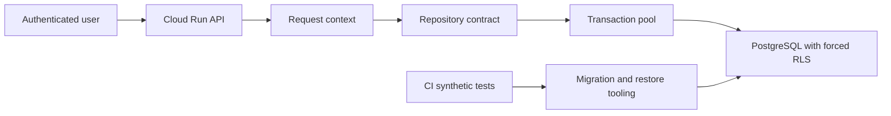

# Threat model 0004 — persistência operacional local

**Status:** aceito para a Spec 0011  
**Data:** 30 de agosto de 2026  
**Escopo:** `database/`, repositories de fundação, configuração de conexão e
testes/CI relacionados  
**Custo:** [Avaliação 0017](../costs/0017-local-operational-persistence.md)

## Executive summary

Os riscos dominantes são acesso cross-tenant por contexto de conexão incorreto,
perda silenciosa de atualização concorrente, reaparecimento de registros
arquivados e restauração que enfraqueça RLS/grants. A etapa permanece local e usa
somente dados sintéticos; conexão gerenciada, dados pessoais e automação de
secrets continuam fora do escopo.

## Scope and assumptions

- Em escopo: migrations, roles, RLS, pool/transações, repositories de perfil e
  alvo, estado por fonte, backup/restore e CI.
- Fora de escopo: Supabase/Infisical/GCP reais, frontend direto no banco, jobs,
  evidência processual, documentos e produção.
- Contexto confirmado pelas specs aceitas: API eventualmente acessível pela
  internet, Firebase como identidade, backend como única porta de dados e tenants
  pessoais/organizacionais.
- Esta fatia não persiste nome, CPF, CNPJ, token, publicação ou segredo real.
- O runtime usa transaction pooling e statements sem nome; cada operação privada
  abre uma transação curta e define usuário/tenant com escopo local.
- Perguntas que alterariam o risco — acesso direto do navegador ao Supabase,
  role administrativa compartilhada ou uso de dados reais — já estão respondidas
  como proibidas nesta etapa.

## System model

### Primary components

- API Node/TypeScript: autentica e cria o contexto confiável
  ([`src/http/server.ts`](../../src/http/server.ts)).
- Repositories: contratos de domínio com adapters em memória e PostgreSQL
  ([`src/application/foundation-repository.ts`](../../src/application/foundation-repository.ts)).
- PostgreSQL: schemas privados, role de runtime, constraints e RLS forçada
  ([`database/migrations/0001_foundation.sql`](../../database/migrations/0001_foundation.sql)).
- Compose/CI: banco descartável, migrations e contracts sem credencial externa
  ([`compose.yaml`](../../compose.yaml), [`.github/workflows/ci.yml`](../../.github/workflows/ci.yml)).

### Data flows and trust boundaries

- Navegador → API: token Firebase e entrada HTTP; HTTPS no ambiente cloud,
  verificação server-side, limite e validação por rota.
- API → `RequestContext`: principal verificado e organização solicitada;
  membership ativa é obrigatória e IDs de contexto são opacos.
- Caso de uso → repository: comandos tenant-scoped e versão esperada; nenhuma
  string SQL ou credencial atravessa o contrato.
- Repository → pool/PostgreSQL: protocolo PostgreSQL parametrizado; transação
  curta, timeouts e `set_config(..., true)` antes de cada operação.
- Migration/restore → PostgreSQL: artefato controlado por engenharia; execução
  privilegiada separada do runtime, resultado verificado por pgTAP.
- CI → banco descartável: fixtures sintéticas; volume sem retenção e sem rede
  para sistemas do produto.

#### Diagram

## Assets and security objectives

| Asset | Why it matters | Security objective |
|---|---|---|
| Tenant-scoped profiles and targets | define what a person/office monitors | C/I/A |
| Membership and tenant context | authorization boundary | C/I |
| Version and lifecycle state | prevents lost updates and stale reappearance | I |
| Source scheduling state | controls collection and cost | I/A |
| Runtime database role | compromise can reach every table granted | C/I/A |
| Migrations and backups | can recreate or weaken all controls | C/I/A |
| CI artifacts/logs | must not expose future data or credentials | C |

## Attacker model

### Capabilities

- usuário autenticado com controle de headers, IDs, paginação e ordem de requests;
- requests concorrentes e repetidos usando versões antigas;
- tentativa de referenciar IDs de outro tenant conhecidos por qualquer meio;
- entrada inválida buscando erro informativo ou exaustão de conexões;
- contributor malicioso tentando ampliar grants ou enfraquecer policies em PR.

### Non-capabilities

- não possui credencial de migration/superuser, acesso ao host ou ao volume;
- não controla migrations aprovadas nem a identidade Firebase de outra pessoa;
- não há dado pessoal, segredo real ou frontend direto no banco nesta fatia.

## Entry points and attack surfaces

| Surface | How reached | Trust boundary | Notes | Evidence |
|---|---|---|---|---|
| Header de organização | request autenticado | usuário → API | só membership ativa resolve | `src/application/request-context.ts` |
| Repository methods | caso de uso | aplicação → adapter | deve exigir contexto/versão | `src/application/foundation-repository.ts` |
| Pool PostgreSQL | adapter | processo → banco | contexto local por transação | `src/infrastructure/postgres-foundation-repository.ts` |
| RLS/policies | toda query privada | role → linha | habilitada e forçada | `database/migrations/0001_foundation.sql` |
| Migration/bootstrap | inicialização local/CI | engenharia → banco | alta permissão e blast radius | `database/bootstrap/00_apply_local_migrations.sql` |
| Backup/restore | novo teste operacional | dump → banco restaurado | deve preservar owner, grants e policies | Spec 0011 |

## Top abuse paths

1. Usuário alterna tenant → conexão retorna ao pool com contexto antigo → query
   posterior lê linhas do tenant anterior → exposição cross-tenant.
2. Dois dispositivos leem versão 1 → ambos atualizam sem condição de versão → a
   segunda escrita sobrescreve a primeira sem aviso.
3. Perfil é arquivado → listagem não filtra lifecycle → item reaparece no painel
   ou volta a alimentar monitoramento.
4. Atacante usa target do tenant B ao criar estado no tenant A → FK sem tenant
   permite alterar agendamento/cursor de outro cliente.
5. Restore recria tabela sem `FORCE ROW LEVEL SECURITY` ou com owner runtime → um
   deploy restaurado ignora a defesa em profundidade.
6. Dump/CI passa a usar base real → artefato ou log preserva PII/segredo fora da
   política de retenção.
7. Contributor amplia `app_runtime` para DDL/BYPASSRLS → uma falha de aplicação
   vira comprometimento integral do banco.

## Threat model table

| Threat ID | Threat source | Prerequisites | Threat action | Impact | Impacted assets | Existing controls | Gaps | Recommended mitigations | Detection ideas | Likelihood | Impact severity | Priority |
|---|---|---|---|---|---|---|---|---|---|---|---|---|
| TM-001 | usuário autenticado | pool reutilizado | explorar contexto de tenant residual | leitura/escrita cross-tenant | dados, membership | `set_config` local, RLS forçada, teste cross-tenant | não há teste explícito de troca na mesma conexão | alternar tenants na mesma pool/conexão e provar reset após commit/rollback | métrica de acesso negado e teste pgTAP | medium | high | high |
| TM-002 | requests concorrentes | mesma versão lida | sobrescrever estado com versão antiga | perda silenciosa de preferência/agendamento | version/lifecycle | coluna `version` e transações curtas | contrato não possui update condicional | `update ... where version = expected returning`, zero linhas = conflito | contar conflitos por operação sem PII | high | medium | high |
| TM-003 | erro de lifecycle | registro arquivado | listar/reativar implicitamente | coleta indevida e dado obsoleto | perfis/alvos | estados enumerados | listagem atual não filtra status | filtro ativo por padrão, includeArchived explícito e versionado, sem hard delete runtime | teste de arquivamento e métrica de alvos ativos | medium | medium | medium |
| TM-004 | usuário autenticado | conhece UUID externo | vincular estado a target de outro tenant | adulteração de coleta/custo | target/source state | FKs compostas em relações atuais | nova relação ainda não existe | incluir `tenant_id` em PK/FK/policy e testar tentativa direta | violation/error rate 23503/42501 | medium | high | high |
| TM-005 | operador/CI | dump indevido | exportar dados reais ou manter artefato | exposição de PII/secrets | backup/CI | guardrails proíbem produção e PII | restore ainda não automatizado | somente DB sintético allowlisted, diretório temporário, remoção garantida | secret scan e assert de marcador sintético | low | high | medium |
| TM-006 | contributor/migration | mudança aprovada sem teste | ampliar grants/enfraquecer RLS | bypass total | role/migrations | pgTAP de privilégios, Checkov/CI/review | restore não prova controles | verificar owner, `relforcerowsecurity`, grants e role após restore | diff de schema/grants no CI | low | high | high |
| TM-007 | cliente abusivo | muitas operações lentas | esgotar pool/locks | indisponibilidade | PostgreSQL/API | pool 5, statement/idle timeout, limite Compose | falta teste de contenção/timeout | transações de um statement, limite de batch/página, teste concorrente controlado | pool wait/timeout/deadlock metrics | medium | medium | medium |

## Criticality calibration

- Critical: bypass pré-auth ou credencial de migration exposta permitindo todos
  os tenants; perda irreversível do banco sem restore.
- High: leitura/escrita cross-tenant autenticada; restore sem RLS; alteração de
  agendamento de outro cliente.
- Medium: lost update de preferência, DoS limitado pelo pool, dump sintético não
  removido.
- Low: enumeração de metadado técnico sem dado privado; falha ruidosa e
  recuperável apenas em ambiente local.

## Focus paths for security review

| Path | Why it matters | Related Threat IDs |
|---|---|---|
| `src/application/request-context.ts` | origem confiável de tenant | TM-001 |
| `src/application/foundation-repository.ts` | contrato de versão/lifecycle | TM-002, TM-003 |
| `src/infrastructure/postgres-foundation-repository.ts` | transação, contexto e SQL | TM-001, TM-002, TM-007 |
| `database/migrations/` | RLS, grants, FKs e lifecycle | TM-004, TM-006 |
| `database/tests/` | evidência de isolamento e restore | TM-001, TM-004, TM-006 |
| `compose.yaml` | limites e descarte do banco | TM-005, TM-007 |
| `.github/workflows/ci.yml` | execução privilegiada e scans | TM-005, TM-006 |

## Quality check

- [x] Entradas HTTP, repository, pool, migration e restore cobertas.
- [x] Cada fronteira aparece em ao menos uma ameaça.
- [x] Runtime separado de local/CI e ferramentas privilegiadas.
- [x] Contexto de produto, ambiente, autenticação, exposição e sensibilidade
  obtido das specs aceitas pelo proprietário.
- [x] Mudanças que exigiriam nova validação estão explicitamente fora do escopo.
