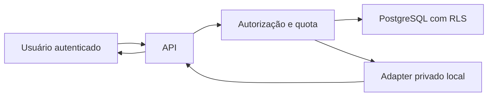

# Threat model 0005 — entrega individual de documento

**Status:** aceito para a Spec 0023  
**Data:** 31 de agosto de 2026  
**Escopo:** autorização PostgreSQL, object storage local e endpoint de conteúdo  
**Custo:** [Avaliação 0030](../costs/0030-local-individual-document-delivery.md)

## Resumo

Os riscos dominantes são IDOR/cross-tenant, path traversal, troca do objeto após
autorização, PDF ativo ou adulterado, enumeração por erro e abuso de bytes. O
gate permanece local, sintético e sem cloud. O cliente controla IDs e ordem das
requisições, mas nunca controla locator, path, hash ou MIME esperado.

## Fronteiras e ativos

Ativos: isolamento de tenant, PDF judicial, ponteiro do objeto, quota, trilha de
auditoria e disponibilidade da API. O token Firebase, conteúdo e locator não
podem aparecer em logs ou respostas de erro.

## Ameaças e mitigações

| ID | Caminho de abuso | Impacto | Controles obrigatórios | Prioridade |
|---|---|---|---|---|
| DDL-001 | trocar `caseId`/`documentId` por ID alheio | vazamento cross-tenant | contexto confiável, FK composta, RLS forçada, função única e `404` uniforme | alta |
| DDL-002 | fornecer path/URL com traversal ou symlink | leitura arbitrária | locator somente do banco, raiz absoluta, allowlist, `O_NOFOLLOW`, arquivo regular | alta |
| DDL-003 | substituir objeto entre catálogo e leitura | conteúdo adulterado | tamanho, assinatura e SHA-256 após leitura; resultado auditado | alta |
| DDL-004 | HTML/SVG/executável disfarçado | XSS/malware | somente PDF, `%PDF-`, malware `clean`, attachment, sandbox, nosniff | alta |
| DDL-005 | comparar erros/tempo para enumerar | descoberta de metadados | `404` genérico antes do storage e sem locator em resposta/log | média |
| DDL-006 | downloads concorrentes/arquivos grandes | custo e indisponibilidade | quota atômica, 25 MiB, rate limit HTTP e sem fallback externo | alta |
| DDL-007 | falha após consumir quota sem registro | auditoria incompleta | autorização append-only antes da leitura e outcome único depois | média |
| DDL-008 | transação aberta durante filesystem/cloud | locks e indisponibilidade | função curta; leitura ocorre após commit | média |
| DDL-009 | bucket futuro público ou IAM amplo | exposição em massa | PAP, UBLA, IAM mínimo e IaC antes de GCS | alta |

## Invariantes verificáveis

- uma autorização referencia exatamente um tenant, usuário, processo, documento
  e artefato já correlacionados pelo banco;
- nenhuma role de runtime possui acesso direto às tabelas de auditoria/quota;
- quota não pode ser ultrapassada por corrida;
- o adapter nunca concatena entrada HTTP ao filesystem;
- bytes só saem após verificação completa e são enviados como attachment;
- qualquer ativação de GCS exige nova revisão deste threat model.
